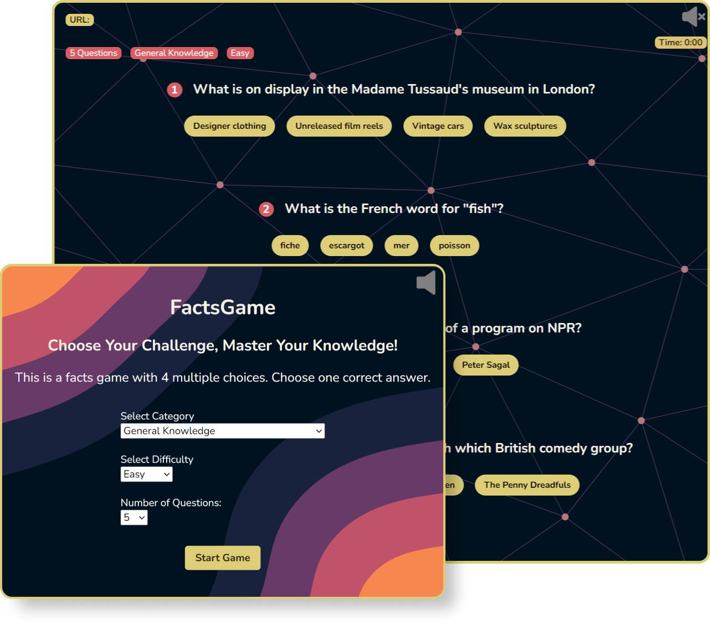
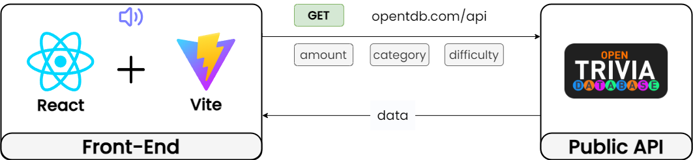
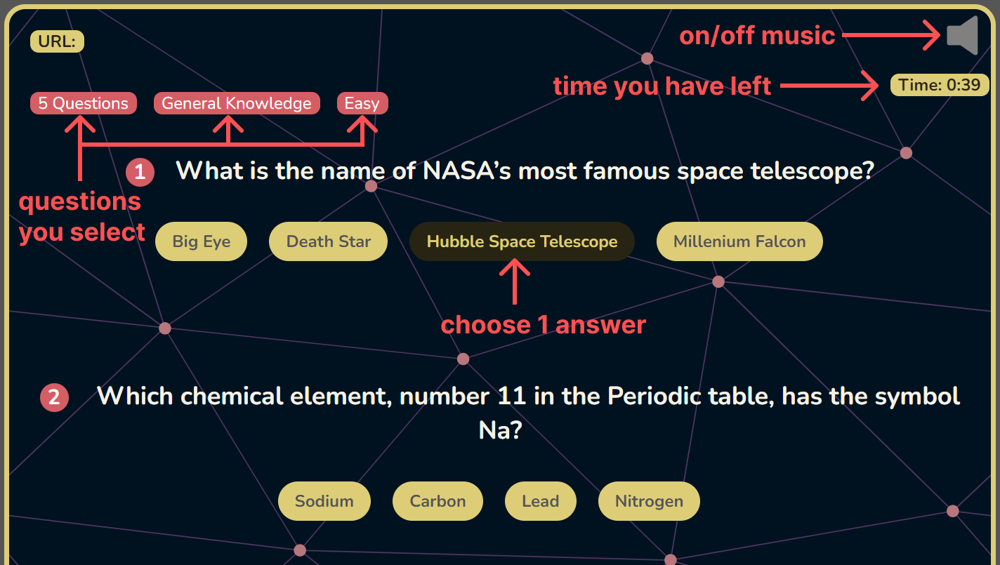
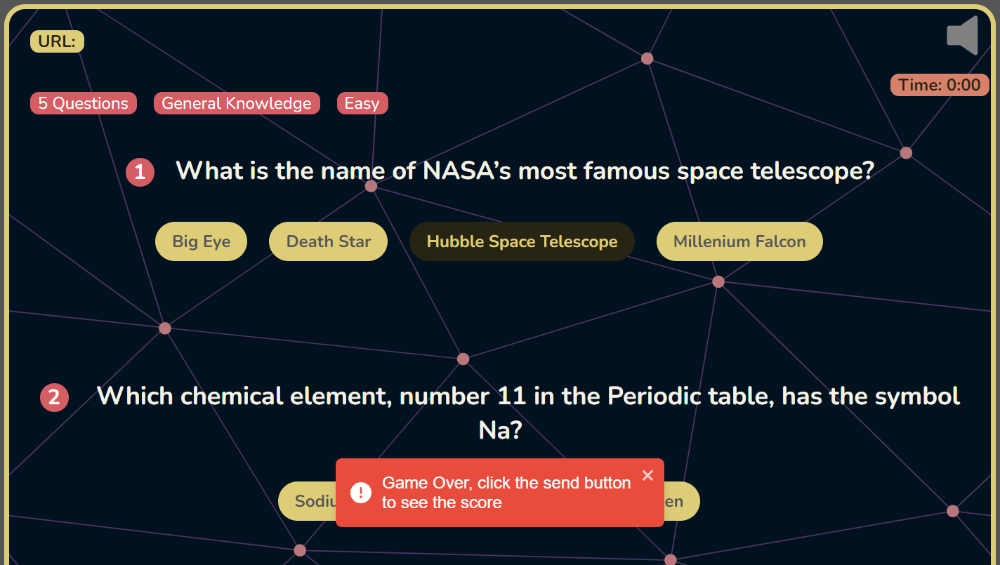
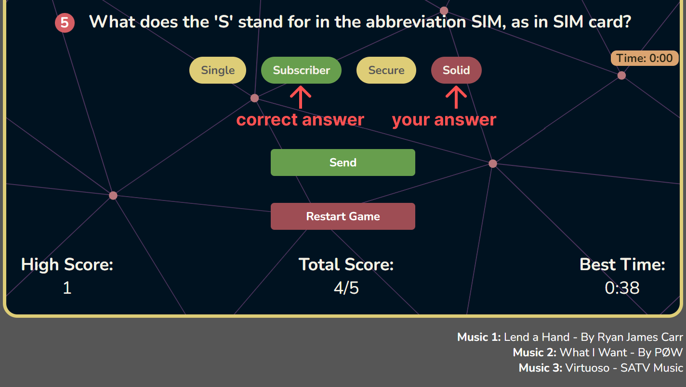

# FactsGame
_Choose Your Challenge, Master Your Knowledge!_
  

## Overview
FactsGame is an interactive platform where players can test their knowledge through multiple-choice challenges.

## Tech Stack

### Front-End
RentFinder's front-end is built with Next.js, enabling fast, SEO-friendly applications through server-side rendering and static site generation. Tailwind CSS is used for rapid UI development with a clean, maintainable codebase, ensuring a seamless user experience for navigating listings and searching properties.

### Back-End
The back-end of RentFinder leverages Next.js as a full-stack solution, utilizing the App Router for intuitive and scalable page routing and Route Handlers for managing API endpoints efficiently. NextAuth.js is integrated for seamless Google authentication, and middleware functions ensure secure and optimized request processing, enhancing the overall robustness and security of the application.

## Features

### Select Question Feature
https://github.com/user-attachments/assets/771d8af9-e7ae-458c-af4a-f435538b13d2

Before you start the game, you can select the type of questions. You can choose from a variety of categories, with 3 difficulty levels (easy, medium, hard), and number up to 50 questions.

### Game Play Feature

Once you start the game, the timer will start counting down. You will be given a number of questions with 4 multiple choice answers. Choose 1 correct answer within the time limit.

If the time runs out before you click the Send button, it is Game Over.

To see correct answer and the score you got, click the Send button at the bottom of the page.

### Calculate Score Feature

After you click the Send button, you will see the correct answer for each question. The correct answer will be highlighted in green. If you choose wrong answer, it will be highlighted in red.

At the bottom of the page, you will see the high score of all your game plays. Total score is the score of your current game. Best time is the time left when you finish the game. The faster you finish the game, the higher the best time will be.

Click Restart Game button will go to first page and selecting type of questions to play again.

### Demo
https://github.com/user-attachments/assets/806e2fbe-260b-4d93-a6d6-851877f4ea5f

Let's see a demo game! Try turn on music ♫
